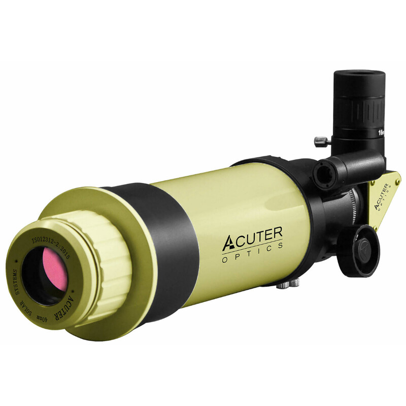

::: {.panel-tabset}

## Descrição

Este é um pequeno, porém notável, telescópio refrator voltado principalmente para a observação da [cromosfera solar](https://en.wikipedia.org/wiki/Chromosphere). É nessa região que o Sol mostra suas estruturas mais fascinantes como as protuberâncias e filamentos, granulações (células convectivas) e erupções solares. Filtros solares comuns não permitem observar esses detalhes pois atenuam igualmente toda a luz solar, incluindo a luz oriunda da cromosfera -- muito mais fraca que a parcela principal vinda da fotosfera.

Na entrada de luz deste telescópio existe um componente chamado etalon, composto por um par de lâminas semireflexivas (interferômetro de [Fabry-Perót](https://en.wikipedia.org/wiki/Fabry%E2%80%93P%C3%A9rot_interferometer)) ajustado para filtrar a linha H-alpha do hidrogênio (656,28 nm). É principalmente na cromosfera solar que ocorre a emissão dessa linha espectral. Ao deixar passar luz com somente a frequência da linha H-alpha, a cromosfera -- antes ofuscada pela fotosfera -- é revelada.

Além da observação do Sol é possível usar esse telescópio para observação noturna de objetos brilhantes como a Lua e os planetas. Para isso, basta substituir o etalon na entrada do telescópio e trocar a buscadora solar por uma buscadora noturna inclusa com o equipamento.

## Instruções

### Instalação do telescópio

Texto em construção.

### Uso

Texto em construção.

## Especificações

*Extraídas de astroshop.eu*

### Óptica

- **Tipo:** Refrator
- **Tipo de construção:** Solar H-Alpha
- **Abertura:** 40 mm
- **Distância focal:** 400 mm
- **Razão focal (f/):** 10
- **Capacidade de resolução:** 3,45"
- **Valor limite (magnitude):** 9,8
- **Capacidade de captação de luz:** 30x
- **Aumento máximo útil:** 80x
- **Peso do tubo:** 2 kg
- **Comprimento do tubo:** 412 mm
- **Sistemas de filtro:** H-alpha (656,28 nm)
- **Largura de banda:** < 0,06 nm
- **Filtro de bloqueio:** 8 mm

### Focalizador

- **Tipo de construção:** Crayford
- **Conexão para ocular:** 1,25 polegadas
- **Backfocus:** 55 mm
- **Giratório:** Sim

### Montagem

- **Tipo de construção:** OTA (Apenas Tubo Óptico)
- **Tipo de montagem:** Sem montagem incluída

### Acessórios Incluídos

- **Ocular de 1,25":** Ocular Zoom
- **Buscadora (Finder scope):** Buscadora Solar
- **Óptica desviadora:** Filtro de bloqueio (Blockfilter)
- **Trilho de prisma:** Estilo Vixen
- **Rosca para tripé fotográfico:** 1/4"
- **Filtros solares:** Sim
- **Estojo/Maleta de transporte:** Sim
- **Base para buscadora:** Braçadeira de prisma
- **Abraçadeiras de tubo:** Não
- **Diversos:** Buscadora de ponto vermelho (Red dot finder)
- **Adaptador para câmera:** Smartphone

### Área de Aplicação

- **Sol:** Sim
- **Lua e Planetas:** Sim
- **Nebulosas e Galáxias:** Não recomendado
- **Astrofotografia:** Não

:::

