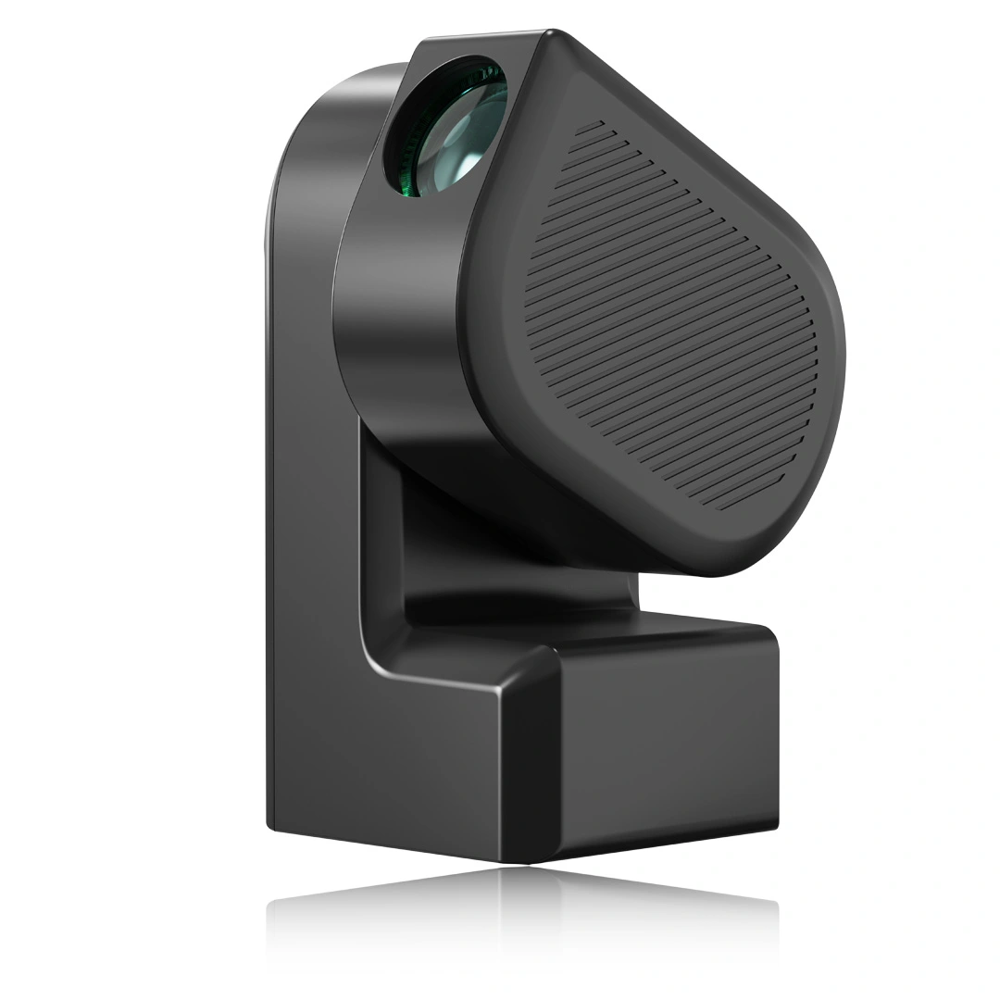

::: {.panel-tabset}

## Descrição

O Seestar S50 é um telescópio inteligente "All-in-One" desenvolvido pela ZWO, projetado para simplificar a astrofotografia e a observação astronômica. Ele integra em um corpo compacto e leve (apenas 2,5 kg) um sistema óptico refrator apocromático, uma câmera astronômica, foco elétrico, uma montagem altazimutal motorizada, um computador de bordo (similar à funcionalidade do ASIAIR) e uma roda de filtros com um filtro de banda dupla (light pollution) e um filtro solar dedicado.

Seu design óptico é um triplete apocromático com 50 mm de abertura e 250 mm de distância focal, resultando em uma razão focal de f/5. Esta configuração é otimizada para astrofotografia de campo amplo de objetos do céu profundo, bem como para observação da Lua e do Sol (com o filtro solar incluso).

O telescópio é controlado inteiramente por um aplicativo dedicado (Seestar app) disponível para smartphones e tablets, que oferece funcionalidades como GoTo automático, rastreamento preciso, empilhamento de imagens ao vivo (live stacking), e plate solving. O aplicativo também inclui um banco de dados astronômico, recomendações de observação e funcionalidades de comunidade para compartilhar imagens.

Devido à sua facilidade de uso, portabilidade e recursos integrados, o Seestar S50 é uma excelente escolha para iniciantes em astrofotografia e para observadores que buscam uma solução prática e rápida para explorar o céu noturno e diurno (Sol).

## Instruções

### Instalação e Configuração Inicial

A instalação e operação do Seestar S50 são guiadas principalmente pelo aplicativo Seestar. De forma resumida, o processo envolve:

1.  **Montagem Física:**

    *   Retire o Seestar S50 e o tripé do estojo protetor. Atenção: o corpo do telescópio não possui alças e é um tanto escorregadio, por isso segure-o pelo corpo fixo do telescópio com firmeza e cuidado. **Nunca segure, transporte ou puxe este telescópio pelo braço móvel (motorizado)**.
    *   Fixe o Seestar S50 no tripé utilizando a rosca padrão de 3/8 de polegada na base do telescópio. Certifique-se de que o tripé esteja nivelado.

2.  **Ligar e Conectar ao Aplicativo:**

    *   Pressione e segure o botão de energia do Seestar S50 por aproximadamente 2 segundos para ligá-lo. Uma indicação sonora e luminosa confirmará que está ligado e pronto para conexão.
    *   Baixe e instale o aplicativo "Seestar" na loja de aplicativos do seu smartphone ou tablet.
    *   Ative o Bluetooth e o Wi-Fi no seu dispositivo móvel.
    *   Abra o aplicativo Seestar e siga as instruções para conectar-se ao telescópio. A primeira conexão geralmente envolve pareamento Bluetooth e, em seguida, conexão à rede Wi-Fi gerada pelo Seestar S50.
    *   Para o primeiro uso, o aplicativo guiará por um processo de ativação do dispositivo, que requer conexão à internet no seu smartphone/tablet.

3.  **Nivelamento e Calibração:**

    *   O aplicativo possui uma ferramenta de nivelamento. Ajuste as pernas do tripé até que o indicador de nível no aplicativo mostre que o telescópio está corretamente nivelado. Um bom nivelamento é crucial para a precisão do GoTo e do rastreamento.
    *   O sistema GoTo do Seestar S50 geralmente se calibra automaticamente usando plate solving após o apontamento inicial para o céu.

4.  **Observação e Astrofotografia:**

    *   **Seleção de Alvo:** Use o atlas celeste, as recomendações ou a busca no aplicativo para selecionar um objeto celeste.
    *   **GoTo:** Toque no objeto desejado e o telescópio se moverá automaticamente para apontar para ele.
    *   **Foco:** O S50 possui autofoco, que pode ser ativado pelo aplicativo. Ajustes finos manuais também podem ser possíveis.
    *   **Filtros:**
        *   Para objetos do céu profundo em áreas com poluição luminosa, ative o filtro de banda dupla (LP filter) no aplicativo.
        *   **Para observação solar:** Certifique-se de que o filtro solar dedicado (branco, geralmente com encaixe magnético ou de rosca) esteja CORRETAMENTE E FIRMEMENTE instalado na frente da lente ANTES de apontar o telescópio para o Sol. Selecione o modo "Solar" no aplicativo. **NUNCA observe o Sol sem o filtro solar apropriado.**
    *   **Captura de Imagens:** Inicie o modo de captura no aplicativo. Para objetos do céu profundo, o Seestar S50 utiliza o empilhamento ao vivo (live stacking) para progressivamente melhorar a qualidade da imagem ao longo do tempo.

### Desligar e Guardar

1.  Ao final da sessão, feche o aplicativo e desligue o Seestar S50 pressionando e segurando o botão de energia.
2.  Desmonte o telescópio do tripé e guarde-os no estojo de proteção para evitar poeira e danos.

Consulte o manual do usuário completo fornecido pela ZWO para instruções detalhadas, dicas de solução de problemas e informações de segurança.

## Especificações

[Extraídas do manual do usuário ZWO Seestar S50](https://i.seestar.com/owe__prod/static/manuals/SeestarManualEN202310.pdf)

### Informações do Tubo Óptico e Sistema Integrado
- **Design Óptico:** Refrator Apocromático Triplete
- **Abertura:** 50 mm
- **Comprimento Focal:** 250 mm
- **Razão Focal:** f/5
- **Sensor da Câmera:** IMX462
- **Resolução da Câmera:** 1920 x 1080 pixels (Full HD)
- **Foco:** Elétrico, com capacidade de autofoco
- **Filtros Integrados:**
    - Filtro de banda dupla para poluição luminosa (OIII 30nm / H-alfa 20nm), selecionável via app
    - Filtro Solar dedicado (para observação da fotosfera solar), de encaixe frontal
- **Armazenamento Interno:** 64 GB
- **Peso (unidade principal):** 2,5 kg
- **Dimensões (unidade principal):** 142,5 mm (L) x 130 mm (P) x 257 mm (A)
- **Temperatura de Operação:** -10°C a 40°C
- **Aquecedor de Orvalho (Dew Heater):** Integrado, controlável via app

### Informações da Montagem e Controle
- **Tipo de Montagem:** Altazimutal Motorizada Computadorizada
- **Sistema GoTo:** Sim, controlado por aplicativo com plate solving automático
- **Rastreamento:** Sim, altazimutal com correção de rotação de campo para exposições curtas e médias (via live stacking)
- **Conectividade:**
    - Wi-Fi (2.4G/5G) para comunicação com o aplicativo
    - Bluetooth para conexão inicial e alguns controles
    - Porta USB-C (para carregamento da bateria e transferência de dados)
- **Bateria:** Interna recarregável de Íons de Lítio, 6000 mAh (aproximadamente 6 horas de uso, dependendo das condições)
- **Tripé:**
    - Incluso: pequeno tripé de mesa/campo (altura máx. 363mm)
    - Conexão: Rosca padrão de 3/8 de polegada (compatível com a maioria dos tripés fotográficos)
- **Armazenamento:**
    -  Estojo *EPP Shockproof Case*
- **Recursos Adicionais do Aplicativo:**
    - Banco de dados astronômico com informações sobre objetos
    - Atlas celeste interativo
    - Recomendações de "Melhores objetos para esta noite"
    - Modo de fotografia para paisagens (Scenery Mode)
    - Compartilhamento de imagens e integração com comunidade online Seestar/ZWO

:::