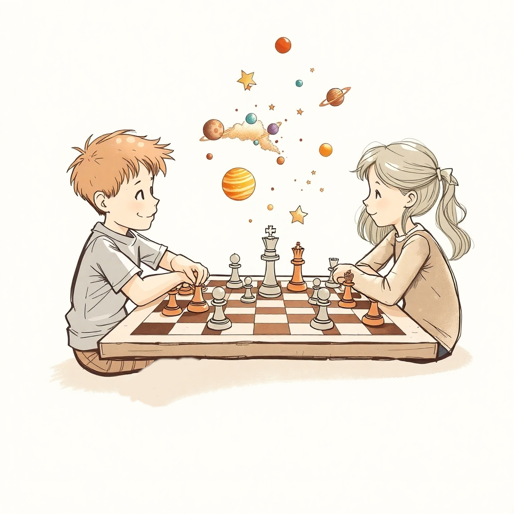
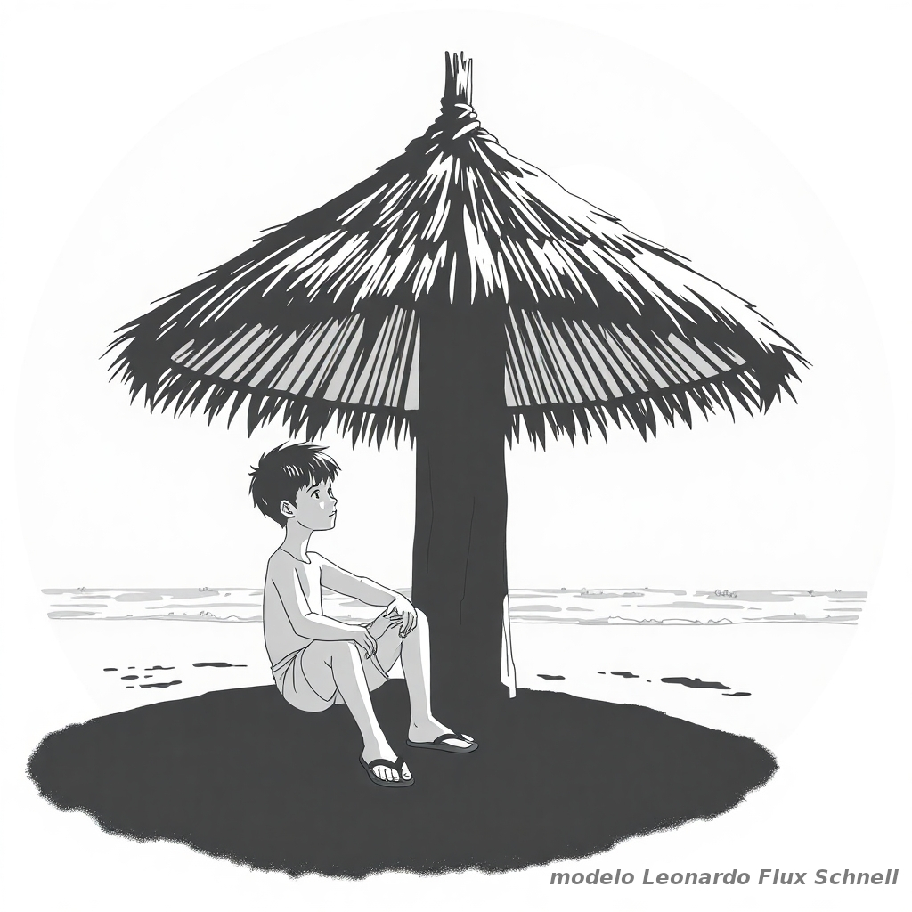
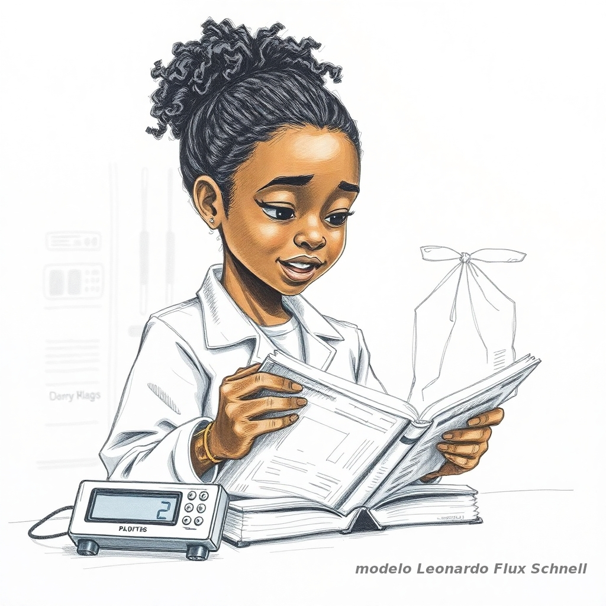
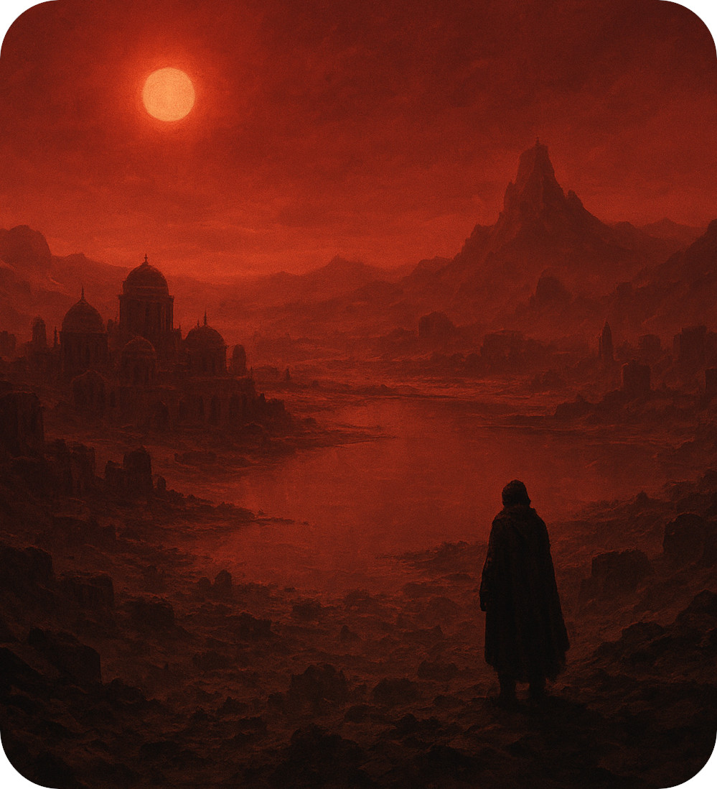
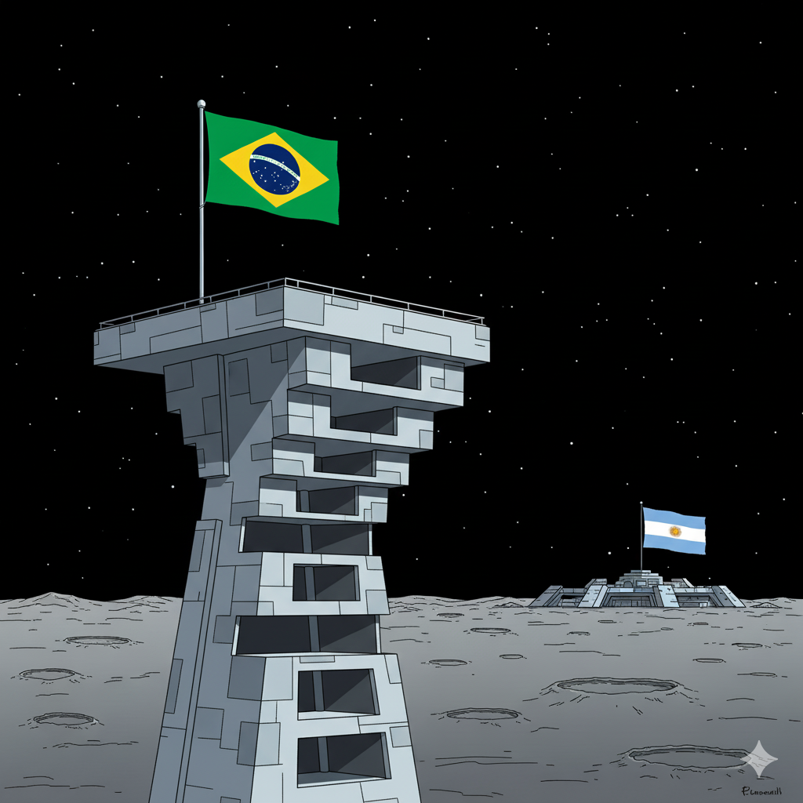

{fig-align="center" .responsive-img .preview-image}

Se você acredita que a física é apenas teoria ou sem relação com a astronomia, prepare-se para um confronto com a realidade dos desafios práticos. Cada enigma é uma estrela em nossa constelação, esperando para ser desvendada por mentes curiosas e tenazes. Prove que você tem a massa crítica de conhecimento para iluminar a escuridão da dúvida!

_Caso ache que conseguiu encontrar alguma resposta convincente para algum dos desafios, compartilhe conosco escrevendo para `observe@ufscar.br` e nós daremos um retorno._

#### Leste urgente!
::: {.callout-tip collapse="true"}
# Abra o desafio

{.img-left}

Newtinho, um estudante de física confiante em sua capacidade de resolver problemas práticos, estava de bermuda e chinelo curtindo as férias com amigos em uma cidade litorânea completamente desconhecida para ele. Em meio a risadas e o som das ondas, Newtinho, no auge de sua autoconfiança, se vangloriou de que conseguiria se orientar muito rapidamente em praticamente qualquer lugar do mundo que estivesse ensolarado, mesmo sem bússola, mapa ou qualquer tecnologia moderna, utilizando apenas seus conhecimentos de física e astronomia. Seus amigos, céticos e com um brilho de desafio nos olhos, não perderam a oportunidade. Vendaram seus olhos, o guiaram por ruas e vielas desconhecidas e o deixaram sob a sombra fresca de um quiosque redondo à beira-mar, o sol a pino e implacável sobre ele. Com um cronômetro marcando apenas 30 segundos, retiraram a venda dos olhos de Newtinho e lançaram o ultimato: "Prove sua física, Newtinho! Aponte para o leste e vença a aposta. Se acertar, jantar chique por nossa conta. Se falhar... bem, prepare o bolso para rodadas e rodadas de sorvete para todos nós durante o resto das férias!". Newtinho, agora sozinho no quiosque circular, sem absolutamente nenhum objeto ou ferramenta à sua disposição, encara o desafio. Como Newtinho pode usar seus conhecimentos de física e astronomia para determinar a direção leste em meros 30 segundos e escapar da avalanche de sorvetes?

---

|   **Criação do Problema e Solução Original:** [João Teles](/equipe/professores/joao_teles.qmd) que vislumbrou esse problema enquanto fazia exercício sob a sombra de um quiosque.
|   **Desenvolvimento da Narrativa e Colaboração:** [João Teles](/equipe/professores/joao_teles.qmd) e Modelo Gemini 2.0 Flash Thinking Experimental O1-21.

::: {.callout-note collapse="true"}
## Ver a Solução

A resposta não está no céu, mas na memória térmica do solo sob os pés de Newtinho. Ao retirar os chinelos e caminhar pelo perímetro interno da sombra do quiosque, sua pele sente o que seus olhos não veem: a história da manhã. O lado do chão que esteve banhado pelo sol desde o amanhecer acumulou calor (inércia térmica), revelando o Leste. Já o lado oposto, protegido pela sombra do quiosque durante toda a manhã, permanece mais frio, indicando o Oeste. Assim, a física do calor guia Newtinho: o chão quente aponta para onde o sol nasceu, garantindo-lhe o jantar e livrando-o do sorvete. Procure um quiosque ou abrigo sombreado semelhante ao de Newtinho e faça o teste você mesmo(a).

:::

:::

#### O Enigma da Bexiga de Outro Mundo - Desafio de Trappist-1e
::: {.callout-tip collapse="true"}
# Abra o desafio

{.img-left}

O ano é 2347. A humanidade não está mais restrita à Terra. Colônias florescem em diversos sistemas estelares, e um dos mais promissores é Trappist-1e, um exoplaneta rochoso orbitando uma estrela anã vermelha a anos-luz de distância. Elara, uma menina curiosa de 10 anos, vivia em uma das primeiras bio-cúpulas de Trappist-1e, um lar aconchegante sob um céu sempre crepuscular, banhado pela luz avermelhada de sua estrela-mãe.

Em uma tarde tranquila, Elara explorava o sótão da bio-cúpula, um espaço quase museológico repleto de relíquias da "Velha Terra". Seus olhos brilharam ao encontrar um livro de ciências empoeirado, com capa desbotada e páginas amareladas. Era um livro de física básica que outrora pertencia a seu avô, de uma época em que a Terra era o único planeta habitado por humanos.

Folheando as páginas, Elara se deparou com um capítulo intrigante: "O Ar Tem Massa!". O livro explicava como, apesar de ser invisível e aparentemente "leve", o ar era matéria e, portanto, possuía massa. Para provar isso, o livro descrevia um experimento simples:

"Pegue uma bexiga de borracha vazia e pese-a em uma balança. Em seguida, encha a mesma bexiga com ar, amarre-a bem e pese-a novamente. Você verá que a balança indicará um peso maior na segunda medição, comprovando que o ar dentro da bexiga adicionou massa!"

Elara, fascinada pela ideia, decidiu reproduzir o experimento. No laboratório doméstico da bio-cúpula, ela encontrou uma balança digital muito precisa, tecnologia superior às balanças da época do seu avô. Mas havia um problema: bexigas de borracha pareciam ser itens obsoletos em Trappist-1e. "Aniversários em bio-cúpulas são comemorados com projeções holográficas e bolhas de sabão pressurizadas, não bexigas!", pensou Elara, com um sorriso.

Sem bexigas à disposição, Elara teve uma ideia. Ela encontrou um rolo de saquinhos plásticos finos, muito semelhantes aos "saquinhos de lixo" que sua avó terrestre mencionava em suas histórias da Velha Terra. "Elasticidade quase zero, perfeitos!", pensou Elara, com um toque de ironia.

Seguindo as instruções do livro, Elara realizou o experimento com um saquinho plástico:

- Medição do Saquinho Vazio: Com cuidado, colocou um saquinho plástico vazio sobre a balança e registrou a leitura.

- Medição do Saquinho Cheio de Ar de Trappist-1e: Encheu um novo saquinho plástico com ar da bio-cúpula (ar de Trappist-1e, ajustado para ser respirável para humanos), amarrou a ponta com um nó firme e colocou o saquinho cheio na balança. Para sua total frustração, a balança indicou exatamente a mesma leitura!

Elara repetiu o experimento várias vezes, verificou a calibração da balança, usou diferentes saquinhos, mas o resultado era sempre o mesmo: nenhum aumento de massa detectável ao encher o saquinho plástico com ar de Trappist-1e.

"Mas... o livro dizia que o ar tem massa! Será que o livro do meu avô estava errado? Ou será que o ar de Trappist-1e é diferente? Será que a pressão aqui na bio-cúpula, ou a composição do ar, tornam o experimento diferente?", Elara se perguntava, confusa e intrigada. "O que aconteceu com o experimento da bexiga... quer dizer, do saquinho plástico, que não deu certo?"

O Desafio para Você:

Elara precisa da sua ajuda para desvendar esse enigma!

Explique, usando seus conhecimentos de física, por que o experimento de Elara com o saquinho plástico não mostrou o aumento de massa esperado, enquanto o experimento original do livro (com uma bexiga) funcionava (ao menos na Terra).

Ajude Elara a entender o "enigma da bexiga" de outro mundo e a provar que a física funciona até mesmo em Trappist-1e!

---

|   **Criação do Problema e Solução Original:** [João Teles](/equipe/professores/joao_teles.qmd) que pensou nesse problema devido à insatisfação com a forma como o experimento com a bexiga é tratado em alguns livros didáticos.
|   **Desenvolvimento da Narrativa e Colaboração:** [João Teles](/equipe/professores/joao_teles.qmd) e Modelo Gemini 2.0 Flash Thinking Experimental O1-21.

::: {.callout-note collapse="true"}
## Ver a Solução

O segredo não reside na gravidade alienígena, mas na tensão de uma membrana elástica. O experimento original funciona porque a borracha da bexiga comprime o ar em seu interior, aumentando sua densidade em relação ao ar externo; esse excesso de densidade vence o empuxo e a balança registra a diferença. O saquinho plástico de Elara, porém, não oferece resistência elástica: a pressão interna se iguala à externa, e a densidade do ar capturado permanece idêntica à do ar ambiente. Pelo Princípio de Arquimedes, o peso do ar dentro do saco é perfeitamente anulado pela força de empuxo (o peso do ar deslocado), fazendo com que a balança enxergue o ar como "invisível" em termos de peso. Você pode fazer esse experimento com uma balança digital doméstica. Para que a diferença de peso no caso da bexiga seja mensurável pela balança, encha a bexiga o máximo possível até quase estourá-la, pois o ar dentro dela só terá um aumento apreciável de densidade no limite da elasticidade da borracha.

:::

:::

#### O Pesadelo dos Somnians
::: {.callout-tip collapse="true"}
# Abra o desafio

{.img-left}

Em Kepler-1571, um planeta distante banhado pela pálida e avermelhada luz de sua estrela anã, florescia a engenhosa civilização dos Somnians. Seres ligados à terra, os Somnians ergueram suas cidades na superfície de Kepler-1571, um mundo rochoso colossal, cuja generosa gravidade, superior à da Terra, permitia reter uma atmosfera densa e vasta, mesmo sendo composta predominantemente pelo gás mais leve do universo: o gás hidrogênio (H~2~). A vida em Kepler-1571 havia trilhado um caminho evolutivo único, respirando a leveza do hidrogênio, a essência primordial do cosmos. Em comparação com mundos menores e mais quentes, como a Terra, onde o hidrogênio se dissipa para o espaço, Kepler-1571 abraçava seus habitantes com um oceano de hidrogênio gasoso vital. Suas cidades intrincadas, obras de arte em pedra e metal, adornavam as encostas elevadas e os planaltos acima do imponente Lago Celeste, um corpo d'água de beleza ímpar. Suas águas profundas e misteriosas exibiam um reflexo safira de tirar o fôlego, uma joia líquida cintilante sob a luz crepuscular, um fenômeno visual único, paradoxalmente possível graças aos altos níveis de dióxido de carbono (CO~2~) dissolvido em suas profundezas. Este excesso natural de CO~2~ dissolvido na água, armazenado lentamente no leito vulcânico do lago ao longo do último século, criava essa beleza singular e não inspirava receio por ser atóxico para os Somnians. A vida Somnian era tecida com a engenhosidade da terra e a imensidão do céu de hidrogênio, uma sinfonia de existência em Kepler-1571, com o Lago Celeste como sua joia mais preciosa.

A Catástrofe do Vale da Sombra, como ficou conhecida, começou não com um impacto bruto, mas com uma perturbação na dança celeste. Kepler-1571, em sua órbita notavelmente elíptica ao redor de sua estrela, sentiu a influência gravitacional de Harmonia, sua lua companheira. Em um raro "alinhamento cósmico", uma ressonância gravitacional, como um acorde dissonante na sinfonia celeste, intensificou as forças de maré sobre Kepler-1571 durante seu periélio, culminando em um tremor planetário que abalou as cidades Somnians. Na aurora seguinte, sob um céu agora tingido de presságios, o explorador Lyra, com o coração apertado, partiu rumo às planícies próximas ao Lago Celeste, outrora um mosaico vibrante de comunidades Somnians e centros de saber. O que Lyra encontrou, porém, foi um sepulcro planetário.

Sobre o Vale da Sombra, Lyra pairou em silêncio espectral. As cidades do vale, antes pulsantes centros de vida, agora permaneciam inertes, como epitáfios de pedra sob o céu avermelhado. Ao se aproximar, a cena era um retrato da desolação: milhares de Somnians, seres outrora vibrantes e cheios de vida, jaziam caídos em suas moradias e centros comunitários, em meio a ruas e praças, juntamente com suas criaturas domésticas e animais selvagens, todos vítimas da mesma força invisível. A vida, em sua dança e movimento, havia se extinguido no Vale da Sombra, deixando um vazio gelado e amedrontador.

Lyra retornou às cidades elevadas, o alarme de sua nave soando como um grito de agonia no silêncio da manhã. Enquanto as metrópoles celestes acima do Lago Celeste permaneciam intocadas, o Vale da Sombra, em sua localização inferior, fora consumido por uma calamidade silenciosa e seletiva. A renomada física atmosférica, Mestra Rudolfina, liderou uma investigação planetária urgente, seus olhos fixos no Lago Celeste, que agora, estranhamente, havia perdido seu esplendor safira, tornando-se um corpo d'água vulgar que parecia carregar um segredo sombrio e fatal.

Mestra Rudolfina e os cientistas de Kepler-1571, agora diante do Vale da Sombra silenciado para sempre, do Lago Celeste que perdeu seu brilho safira, e de um mistério que paira como uma névoa letal sobre o futuro dos Somnians, lançam um apelo desesperado a você, explorador da ciência e desvendador de enigmas cósmicos. As pistas são fragmentadas, as respostas escorregadias como as lágrimas de safira que já não adornam o lago. Mas a esperança reside na luz da razão e na sua capacidade de decifrar os códigos ocultos da natureza. Aceite o desafio de Kepler-1571 e ajude Mestra Rudolfina a trazer a verdade à tona.

---

|   **Criação do Problema e Solução Original:** [João Teles](/equipe/professores/joao_teles.qmd) que adaptou-o de uma [atividade didática](/atividades/jogos_e_desafios/constelacao_de_enigmas/Atividade_investigativa.pdf), que por sua vez foi inspirada em um caso real acontecido na Terra.
|   **Desenvolvimento da Narrativa e Colaboração:** [João Teles](/equipe/professores/joao_teles.qmd) e Modelo Gemini 2.0 Flash Thinking Experimental O1-21.

::: {.callout-note collapse="true"}
## Ver a Solução

A catástrofe foi uma erupção límnica. O tremor planetário rompeu o equilíbrio do Lago Celeste, liberando abruptamente toneladas de CO~2~ dissolvido. Em um planeta onde a atmosfera é feita do levíssimo Hidrogênio (H~2~), o Dióxido de Carbono (CO~2~) comporta-se como um "líquido" fantasmagórico extremamente pesado. Pela implacável lei da densidade, essa nuvem invisível não subiu, mas escorreu pelas encostas como uma avalanche silenciosa, inundando o Vale da Sombra e expulsando o ar respirável. As cidades altas, ilhas acima desse mar de gás denso, permaneceram salvas, enquanto o vale sucumbia sufocado.

:::

:::

#### Acidente na Lua
::: {.callout-tip collapse="true"}
# Abra o desafio

{.img-left}

Estamos em 2115. A Base Lunar Brasileira "Cruzeiro do Sul" enfrenta sua pior crise de relações públicas. A principal fonte de renda da estação, o turismo espacial, está ameaçada pela inauguração da luxuosa estação vizinha, a "Estación de Los Hermanos", comandada pelos argentinos, que prometem "o melhor churrasco e o melhor tango do lado escuro da Lua". Para piorar, um incidente trágico e misterioso colocou a segurança brasileira em xeque.

O protagonista dessa história infeliz é o **Dr. Caio Torres**. Um geólogo brilhante na Terra, mas um completo novato no ambiente lunar — aquele era seu *primeiro dia* de campo fora da gravidade terrestre.

O incidente ocorreu na Torre de Observação e Descarte. Um detalhe arquitetônico importante desta torre é que ela possui **terraços de manutenção recuados** logo abaixo da plataforma principal, como degraus de uma escada invertida. O Dr. Torres tinha a missão de descartar amostras de rochas lunares lançando-as da plataforma superior.

A Comissão de Vigilantes (burocratas com pouca afinidade com a física) analisou as imagens e decretou: **Homicídio**. Segundo eles, a física não explicava a cena, e alguém teria empurrado o doutor. Se isso se confirmar, o escândalo fará os turistas migrarem em massa para a base argentina.

**O Que as Câmeras Viram (e o que intriga a polícia):**

1.  **A Confiança Excessiva:** O Dr. Torres caminhava em direção ao parapeito segurando uma rocha enorme, do tamanho de uma melancia, com uma facilidade desconcertante. Ele andava rápido, quase saltitando, parecendo ignorar que carregava um objeto volumoso.
2.  **O Tropeço Suspeito:** Ao chegar à marca de segurança para arremessar a pedra, ele travou os pés no chão para frear. Mas, em vez de parar, seu tronco foi projetado violentamente para a frente, como se a rocha tivesse "ganhado vida" e o arrastado para o abismo — algo muito suspeito para os Vigilantes.
3.  **A "Geometria do Crime":** O detalhe que convenceu os vigilantes do assassinato foi a posição final dos corpos no solo lunar. O corpo do Dr. Torres foi encontrado **muito próximo** à base da torre, quase colado à parede (como se ele tivesse caído para trás, em direção aos terraços recuados). Já a rocha que ele segurava foi encontrada a uma distância horizontal **enorme**, muito além de onde seria natural. *"Impossível,"* disse o chefe de segurança, *"Se ele caiu segurando a pedra, ambos deveriam cair na mesma trajetória parabólica. Alguém o empurrou e depois arremessou a pedra longe!"*
4. **O Enigma do Capacete:** O visor do capacete do Dr. Torres, feito de polímero de alta resistência, estilhaçou no impacto, causando despressurização fatal. O fabricante garante que o visor suporta impactos de até 20 km/h. A altura da torre gera exatamente essa velocidade de queda na gravidade lunar.
    - *A Teoria dos Vigilantes:* "Se o corpo dele foi encontrado perto da torre, significa que ele conseguiu 'frear' seu movimento para a frente. **Ora, quem freia, chega devagar!** Se ele freou no ar a ponto de cair reto, o impacto deveria ter sido suave. Se o capacete quebrou mesmo ele tendo 'freado', alguém o arremessou com força para baixo!"

O governo brasileiro está desesperado. Eles precisam provar que não há um assassino à solta, mas apenas um acidente causado por "falta de adaptação às leis da Física na Lua".

**Seu desafio:** Salve a reputação do turismo nacional! Explique, usando conceitos físicos, os dois mistérios que os vigilantes não entendem:

1. Por que ele foi projetado para frente ao tentar parar para lançar a rocha lunar?
2. Como explicar a rocha caindo longe e o corpo caindo perto (lembrando dos terraços recuados)?
3. Por que o argumento dos vigilantes sobre o capacete está fisicamente errado? (Por que "frear" horizontalmente não salvou o visor?)
---

|   **Criação do Problema e Solução Original:** Baseado na atividade didática ["Acidente na Lua" de Paulo R. Scomparin](https://repositorio.ufscar.br/handle/20.500.14289/11932), que utiliza uma narrativa investigativa para o ensino das Leis de Newton.
|   **Adaptação da Narrativa e Colaboração:** [João Teles](/equipe/professores/joao_teles.qmd) e Modelo Gemini 3.0.

::: {.callout-note collapse="true"}
## Ver a Solução

**1. A Armadilha da Inércia:** O Dr. Torres confundiu peso com massa. Na Lua, a rocha tinha peso baixo (parecia leve), mas mantinha sua grande massa. Ao caminhar rápido e frear os pés, a **inércia** da rocha a fez continuar em movimento (1ª Lei de Newton), arrastando o cientista — que tinha pouco atrito no chão devido à baixa gravidade — para fora da torre.
  
**2. Ação e Reação:** Já em queda livre, percebendo os terraços recuados abaixo, Torres tentou se salvar empurrando a rocha violentamente para frente. Pela 3ª Lei de Newton, ao empurrar a rocha, ele recebeu um impulso contrário (para trás). Isso diminui sua velocidade para frente, fazendo-o cair próximo à torre (numa tentativa falha de atingir o terraço), enquanto a rocha ganhou velocidade extra para voar longe.
  
**3. Independência dos Movimentos:** O erro dos vigilantes é misturar movimentos. O empurrão que Torres deu na rocha alterou apenas sua velocidade **horizontal** (fazendo-o cair perto da torre), mas não teve efeito algum sobre sua velocidade **vertical**. A gravidade atuou sobre ele da mesma forma, independentemente de ele estar indo para frente ou parado horizontalmente. Ele atingiu o solo com a mesma velocidade vertical fatal (~20 km/h) determinada apenas pela altura da queda, o suficiente para quebrar o capacete.

:::

:::

---
_Para enriquecer a experiência e explorar novas possibilidades criativas, alguns dos desafios aqui apresentados foram desenvolvidos com o apoio de algum modelo de Inteligência Artificial. Essa colaboração com IA contribuiu para a criação de narrativas envolventes._

_É importante salientar que, embora a IA tenha sido uma ferramenta valiosa no processo de desenvolvimento, **a ideia original, a formulação do problema físico central, sua solução e a motivação subjacente de cada desafio foram integralmente definidos por criadores humanos.**_

_Para detalhes sobre a contribuição específica em cada desafio, consulte o parágrafo de créditos localizado ao final de cada desafio._