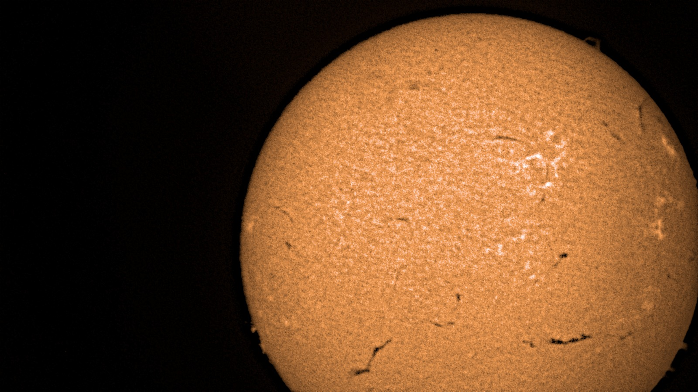

Nos dias 13 e 14 de outubro (terça e quarta-feira) ocorrerá a XX edição do evento Jornada das Estrelas.

_Esta é a segunda vez que a Jornada das Estrelas ocorrerá [à tarde](/atividades/jornada_do_sol/jornada_do_sol.qmd) e [à noite](/atividades/jornada_das_estrelas/jornada_das_estrelas.qmd)!_

- Local: [Praça do Observatório a Olho Nu do CCA-UFSCar](/localizacao/localizacao.qmd)
- Data: 13 a 14/10/26
- Horários:
    - Tarde: 14h às 17h
    - Noite: 19h às 22h

Nesta edição teremos:

- Observação do céu com [telescópios](/acervo/itens/c6-s/c6s.qmd) (Sol à tarde e planetas à noite, caso o céu esteja limpo).
- Visitação ao [Observatório a Olho Nu](/atividades/observatorio/observatorio.qmd) (caso não chova).
- [Caminhada pelos planetas](/atividades/passeio_dos_planetas/passeio_dos_planetas.qmd) (caso não chova).
- Apresentação do Sistema Solar em Realidade Aumentada com nossos [óculos de realidade virtual](/acervo/itens/quest2/quest2.qmd) (em qualquer condição climática).

**Acessibilidade em Libras:** No dia 13/10, das 19h às 20h, as atividades contarão com intérprete de Libras, além de legendas na atividade em Realidade Aumentada.

O circuito completo de atividades terá duração em torno de 1 hora. Como várias atividades são realizadas a céu aberto, recomendamos que os visitantes venham protegidos contra as intempéries.

O evento é GRATUITO e aberto ao público. Não há necessidade de agendamento. Basta comparecer nos dias e horários do evento.

**Aviso às escolas:** nesta Jornada não teremos estrutura para agendamento de turmas grandes. Para garantir a melhor experiência, a visitação será limitada a grupos de até 10 pessoas por vez.

Não percam essa oportunidade! Chamem a família e os amigos!

Divulguem [<i class="bi bi-instagram"></i>](https://www.instagram.com/p/DAW0IgOSeJC/?igsh=MTg5YzNvamt6c3k0MQ==)!

Para dar um gostinho do que poderemos observar no evento, seguem algumas imagens obtidas com os nossos mais recentes telescópios.

 em 07/11/2025](Nebulosa_da_Helice-11_07_25.jpeg)

