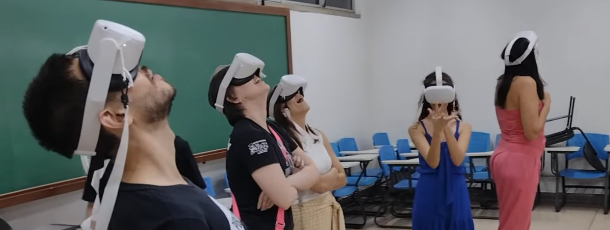

O SisSolXR foi projetado para proporcionar uma experiência imersiva e interativa de aprendizado sobre o Sistema Solar dentro de um ambiente de Realidade Mista.  Utilizando óculos de Realidade Virtual (RV) compatíveis com rastreamento de mãos, a aplicação permite a expĺoração do Sistema Solar em escala, dentro do espaço físico de uma sala de aula, laboratório de ensino ou qualquer ambiente coberto.

O SisSolXR é uma aplicação de código aberto podendo ser obtido em:

- Versão atualizada no [GitHub](https://github.com/jocoteles/SisSolXR)
- Versão publicada: 

### Objetivos Educacionais

- Visualizar e compreender as **escalas de tamanho e distância** no Sistema Solar.
- Explorar as **órbitas e movimentos** dos planetas ao redor do Sol.
- Comparar os **diâmetros planetários** em escala.
- Compreender a **dimensão do Sol** em relação aos planetas.
- Promover a **interação e colaboração** entre participantes no ambiente de aprendizado.

### O Ambiente de Realidade Mista

Ao iniciar o SisSolXR em óculos de RV, os participantes são colocados em um ambiente de Realidade Mista que integra o espaço físico real da sala de aula com elementos virtuais:

- **Espaço Real Integrado:** Os participantes continuam vendo o ambiente físico da sala de aula através dos óculos de RV, permitindo a interação com colegas e o mediador, e a movimentação livre no espaço.
- **Janela para o Espaço Sideral:** Paredes virtuais são sobrepostas nas paredes da sala, criando a ilusão de um espaço aberto acima do teto, como uma "janela para o espaço sideral" (o "espaço superior"). O espaço da sala ao nível do chão é chamado de "espaço inferior".
- **Objetos Virtuais Interativos:**  O Sol e os planetas do Sistema Solar são renderizados como objetos 3D virtuais dentro deste ambiente misto.

### Interação com o Aplicativo

A interação no SisSolXR é feita principalmente através do **rastreamento das mãos**:

- **Mãos Virtuais:** As mãos dos usuários são rastreadas e representadas virtualmente como "luvas virtuais" no ambiente misto.
- **Apertar Botões:**  Botões virtuais podem ser pressionados com as mãos virtuais para iniciar ações e navegar na aplicação.
- **Painel de Controle:** Um painel de controle virtual é invocado por um botão inicial no centro da sala. Este painel, visível apenas para quem o invocou (geralmente o mediador), permite controlar as etapas da atividade e selecionar planetas.

### Etapas da Atividade Educacional SisSolXR

O SisSolXR é estruturado em quatro etapas principais, cada uma focada em diferentes aspectos do Sistema Solar:

**Etapa 1: Raios Orbitais em Escala no Espaço Superior**

- **Objetivo:** Visualizar as distâncias relativas dos planetas ao Sol (raios orbitais) em escala.
- **Descrição:** Os planetas são posicionados no "espaço superior" (acima do teto virtual), em planos orbitais a cerca de 10 metros do solo. Os raios orbitais são transformados para caberem no espaço virtual, com Mercúrio mais próximo do Sol e Netuno mais distante. Os diâmetros e velocidades de translação dos planetas são ajustados para serem visíveis e perceptíveis a essa distância. As velocidades de rotação são menos relevantes nesta etapa.
- **Conteúdo Educacional:** Escala do Sistema Solar, distâncias planetárias, órbitas planetárias.

**Etapa 2: Apreciação Individual dos Planetas no Espaço Inferior**

- **Objetivo:** Explorar cada planeta individualmente, focando em suas características visuais e movimentos.
- **Descrição:** Os planetas são trazidos um a um para o "espaço inferior" (nível da sala). Seus diâmetros e velocidades de translação são ajustados para que tenham um tamanho apreciável (30 a 40 cm de diâmetro) e órbitas menores (2 m de raio) ao redor do Sol, a cerca de 1,5 m do solo. A inclinação dos eixos de rotação planetária é representada fielmente. O Sol também é renderizado no "espaço inferior", mas com um diâmetro reduzido (20 cm) para focar nos planetas.
- **Conteúdo Educacional:** Características dos planetas (superfície, atmosfera), período orbital, período de rotação, inclinação axial.

**Etapa 3: Diâmetros Planetários em Escala no Espaço Inferior**

- **Objetivo:** Comparar os tamanhos dos planetas em escala relativa.
- **Descrição:** Os planetas permanecem no "espaço inferior". Os diâmetros dos planetas são ajustados usando uma transformação de escala para representar o tamanho relativo entre eles. O Sol permanece com o mesmo tamanho e posição da Etapa 2 (não está em escala nesta etapa).
- **Conteúdo Educacional:** Tamanho relativo dos planetas, comparação de dimensões planetárias.

**Etapa 4: Sol em Escala no Espaço Superior**

- **Objetivo:** Demonstrar o tamanho real do Sol em escala com os planetas (da Etapa 3).
- **Descrição:** Apenas o Sol é transformado nesta etapa. Seu diâmetro é ajustado usando a mesma da Etapa 3, resultando em um Sol enorme (10 metros de diâmetro). O Sol é então elevado lentamente para o "espaço superior" até que sua superfície fique a cerca de 2 metros do solo, mostrando sua imensidão em relação ao espaço da sala e aos tamanhos planetários da Etapa 3.
- **Conteúdo Educacional:** Tamanho do Sol em escala com os planetas, a magnitude do Sol no Sistema Solar.

### Dinâmica da Atividade Educacional

Uma possível dinâmica para conduzir uma atividade educacional com SisSolXR é a seguinte:

1.  **Preparação Inicial:** Os participantes são dispostos em círculo no centro da sala. É explicada brevemente a atividade e o uso dos óculos de RV. São fornecidas instruções sobre como interagir e o que evitar fazer com as mãos para não sair da aplicação acidentalmente.
2.  **Distribuição e Ajuste dos Óculos:** Os óculos de RV são distribuídos aos participantes, com auxílio no ajuste correto e confortável em seus rostos.
3.  **Início da Etapa 1 (Raios Orbitais):** Solicita-se que os participantes olhem para cima (espaço superior). A Etapa 1 é iniciada no painel de controle. É conduzida uma discussão sobre o que é observado no "céu virtual", com perguntas sobre o que os objetos e suas posições representam. São explorados os conteúdos relacionados à Etapa 1 (escalas de distância, órbitas, movimento orbital).
4.  **Etapa 2 (Planetas Individuais):** Inicia-se a Etapa 2 e os planetas são trazidos um a um para o "espaço inferior". É conduzida a exploração de cada planeta, incentivando os participantes a observar suas características, aparência da atmosfera, inclinações dos eixos de rotação, e a interagir (aproximar-se, "tocar"). São discutidos os conteúdos da Etapa 2 (características planetárias, rotação, translação). Adicionalmente, podem-se explorar as causas das estações do ano devido à inclinação do eixo de rotação planetário.
5.  **Etapa 3 (Diâmetros Planetários):** A Etapa 3 é iniciada. Os participantes são incentivados a se movimentarem livremente na sala para comparar os tamanhos dos diferentes planetas em escala. São explorados os conteúdos da Etapa 3 (tamanhos relativos dos planetas).
6.  **Etapa 4 (Sol em Escala):** A atividade é finalizada com a Etapa 4. Os participantes são preparados para a visualização do Sol em escala. A Etapa 4 é iniciada e observa-se a ascensão do Sol gigante no "espaço superior". A discussão é concluída com os conteúdos da Etapa 4 (tamanho do Sol e sua importância).
7.  **Encerramento e Discussão Final:** Após a Etapa 4, os óculos são retirados dos participantes. É promovida uma discussão final sobre o que foi aprendido, impressões e dúvidas.

### Materiais Necessários

- **Notebook Servidor:** Um notebook com capacidade de configurar um hotspot Wi-Fi e rodar o servidor web SisSolXR.
- **Óculos de Realidade Virtual (Meta Quest 2 ou similares):**  Óculos de RV com capacidade de rastreamento de mãos e navegador web integrado. Idealmente, um conjunto de óculos para os participantes e um para o mediador (já testamos de forma bem sucedida com até 11 óculos de RV).
- **Espaço Físico Adequado:** Uma sala ou laboratório com área entre 30 e 50 m² para permitir a adequada acomodação dos planetas e a movimentação dos participantes.

### Considerações Finais

- **Adaptação ao Nível Escolar:** A linguagem e o vocabulário da discussão são adaptados aos diferentes níveis de escolaridade dos participantes.
- **Interação e Perguntas:** É incentivada a interação dos participantes entre si e com o mediador, estimulando-se perguntas ao longo da atividade.
- **Observação e Registro:** Durante a atividade, são observadas as reações e interações dos participantes para enriquecer o relato da experiência e aprimorar futuras aplicações.

## Financiamento

Este projeto é uma das atividades financiadas pelo CNPq por meio da Chamada CNPq/MCTI/FNDCT 39/2022 "Programa de Apoio a Museus e Centros de Ciência e Tecnologia e a Espaços Científico-Culturais" (processo 407086/2022-6) dentro da Linha 3: Divulgação Científica e Educação Museal.
